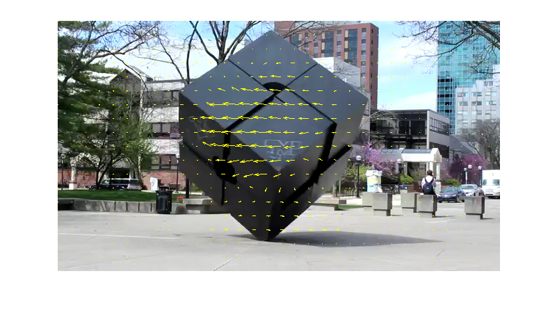

## **Optical Flow with python using OpenCV**

>### **What is Optical Flow?**

Optical flow is the process of estimating per-pixel motion between two successive frames in a movie. Essentially, the Optical Flow task is calculating the shift vector for each pixel as the difference in object displacement between two contiguous images. The basic goal of Optical Flow is to calculate the displacement vector of an object as a result of its motion or camera motions. The relative motion of objects and the spectator can cause optical flow. It can be used for a wide range of purposes. Segmentation, for example, or object detection and tracking.

---

>### **Sparse Optical Flow**

To calculate the Optical Flow for a sparse feature collection, the Lucas-Kanade approach is widely utilised. This method's primary premise is based on the assumption of local motion constancy, in which neighbouring pixels have the same displacement direction. This assumption aids in the approximate solution of the two-variable equation.

---

>### **Applications of Optical Flow**

Optical Flow can be employed in a variety of situations where object motion information is important. Compression, stabilisation, and slow-motion are all frequent uses of Optical Flow in video editors. Optical Flow is also used in jobs like Action Recognition and real-time tracking systems.

---

>### **Conclusion**

In this article, we looked at the Optical Flow job, which is useful when we need to know how objects move. We looked at various famous algorithms, their theoretical concepts, and their practical applications using the OpenCV library. Actually, the computational approach isn't the only way to estimate optical flow. The quality of Optical Flow estimate has improved thanks to new Deep Learning-based techniques.

---

>### **References**

- [Object Tracking - OpenCV](https://docs.opencv.org/4.5.3/dc/d6b/group__video__track.html)
- [Lucas-Kanade Optical Flow in OpenCV](https://opencv24-python-tutorials.readthedocs.io/en/latest/py_tutorials/py_video/py_lucas_kanade/py_lucas_kanade.html)
- [Optical Flow in OpenCV](https://learnopencv.com/optical-flow-in-opencv/#what-is-optical-flow)
- [Introduction to Motion Estimation with Optical Flow](https://nanonets.com/blog/optical-flow/)

---